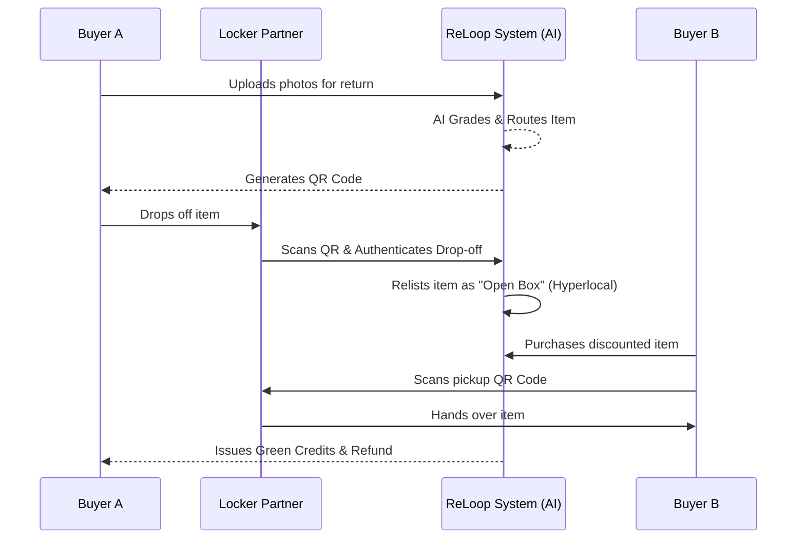

# ♻️ ReLoop: Hyperlocal Circular E-Commerce & Returns


**Live AWS Deployment:** [http://13.63.255.242](http://13.63.255.242)

ReLoop intercepts the traditional, highly-polluting e-commerce return cycle. Instead of shipping returned items back to centralized mega-warehouses (which generates massive carbon emissions and logistics costs), ReLoop routes returns to localized "Locker Partners" (neighborhood stores) where they are immediately relisted for community resale at a discount. 

---

## 🎯 The Core Problem
1. **Carbon Footprint:** Reverse logistics for e-commerce returns generate millions of metric tons of CO2 annually.
2. **Financial Loss:** Processing a return often costs sellers more than the item is worth, leading to perfect goods being sent to landfills.
3. **Consumer Friction:** Printing labels, finding boxes, and waiting in line at the post office is highly inconvenient.

## 💡 The ReLoop Solution
1. **Scan & Drop:** A buyer initiates a return, receives a QR code, and drops the item off unboxed at a local Kirana store (a ReLoop Locker) within walking distance.
2. **Instant Hyperlocal Resale:** The item is automatically graded and instantly relisted on the ReLoop platform as "Open Box". Using `2dsphere` geographic indexing, it is only shown to buyers within a 20km radius.
3. **Community Pickup:** A neighboring buyer purchases the heavily discounted item and picks it up from the same locker. 
4. **Green Credits:** Sustainable behavior is rewarded with platform-wide "Green Credits."

---

## 🤖 AI Automations & Smart Features

ReLoop is heavily powered by **Google Gemini AI**, acting as the brain behind the platform's logistics and user experience:

* **Loopy (Context-Aware Chatbot):** A highly intelligent AI assistant embedded in the platform. Loopy adapts its responses based on whether you are a Buyer, Seller, or Guest. It doesn't just give generic answers; it uses real-time platform data to tell buyers exactly what items are available nearby or show sellers their live return statistics.
* **AI Image Grading:** When a seller initiates a return, they upload photos of the item. Gemini Vision instantly analyzes the images to assign a grade (A: Like New, B: Lightly Used, C: Needs Refurbishment, D: Damage).
* **Smart Routing Engine:** Based on the AI Grade and geospatial data, the backend autonomously decides the best route for an item: *Sell to Neighbor*, *Ship to Warehouse*, *Send to Refurbisher*, or *Donate/Recycle*.
* **Return Prevention:** Before a user even buys an item, our AI analyzes their profile (e.g., foot length vs shoe size) and explicitly warns them if a purchase has a high statistical probability of being returned, preventing the logistical waste before it even begins.

---

## 🏗️ System Flow & Lifecycle



---

## 🗂️ Project Architecture & Folder Structure

The application is structured as a mono-repo containing isolated frontend and backend environments, orchestrated together via Docker.

```text
hackon_AlgoArchitects/
├── backend/                       # Node.js / Express Backend
│   ├── src/
│   │   ├── config/                # Environment, logger, DB connections
│   │   ├── middleware/            # JWT Auth, Validation, Mock Demo checks
│   │   ├── models/                # Mongoose Database Schemas (See DB Section)
│   │   ├── routes/                # Express API Route controllers
│   │   ├── seed/                  # Database seeding scripts for Demo Mode personas
│   │   ├── services/              # AI Agents (Gemini), Cognito, Razorpay, Geocode
│   │   └── index.ts               # Express Server Entry Point
│   ├── package.json
│   └── tsconfig.json
│
├── frontend/                      # Next.js 14 (App Router) Frontend
│   ├── app/                       # Page routes, layouts, and global CSS
│   │   ├── (dashboard)/           # Protected layouts
│   │   ├── account/               # User profile management
│   │   ├── admin/                 # Admin oversight tools
│   │   ├── locker/                # Kirana partner QR scanning interface
│   │   ├── login/                 # Multi-role authentication flows
│   │   ├── returns/               # User return initiation pipeline
│   │   ├── seller/                # Economics & Environmental Dashboard
│   │   └── page.tsx               # Primary landing page
│   ├── components/                # Reusable UI (Cards, Nav, Sidebars, Modals)
│   ├── lib/                       # API clients, Context Providers (Auth, Toast)
│   ├── hooks/                     # Custom React hooks
│   └── tailwind.config.ts         # Design system tokens (Amazon aesthetic)
│
├── deploy/                        # AWS Deployment Scripts & Configurations
├── docker-compose.yml             # Local Development Orchestration
└── docker-compose.prod.yml        # Production Orchestration
```

---

## 💽 Database Schema (MongoDB / Mongoose)

The backend utilizes a heavily relational document structure optimized for geospatial queries.

| Model | Description | Key Fields |
|-------|-------------|------------|
| **`User`** | Handles all RBAC roles (buyer, seller, locker). | `role`, `location` (PointSchema), `age`, `greenCredits`, `cognitoSub` |
| **`Listing`** | The actual items available for sale. | `status` (LIVE, SOLD), `condition`, `location`, `price`, `lockerId` |
| **`Order`** | Transaction records connecting buyers to listings. | `buyerId`, `sellerId`, `status`, `paymentId` |
| **`Return`** | Tracks the reverse-logistics pipeline. | `dropoffCode`, `lockerId`, `carbonSaved`, `status` (DROPPED_OFF, RELISTED) |
| **`Locker`** | The physical drop-off points (Kirana stores). | `partnerType`, `capacity`, `location`, `address` |
| **`GreenCredit`**| Ledger for carbon-offset gamification points. | `userId`, `amount`, `source` (RETURN_COMPLETED, BOUGHT_USED) |
| **`PreventionStat`** | Aggregated ecological impact analytics. | `tonsCo2Prevented`, `packagingSaved`, `logisticsSaved` |

*Note: All core geographic searches (finding nearby lockers or nearby buyers) utilize MongoDB's `$near` operator on `2dsphere` indexes.*

---

## 🔐 Two Execution Modes (Demo vs. Production)

ReLoop is uniquely engineered with two entirely distinct execution environments to cater to both high-speed Hackathon judging and real-world production security.

### 1. Demo Mode (`NEXT_PUBLIC_DEMO_MODE=true`)
Designed for **zero-friction testing**. 
* **Persona Switcher:** Bypasses the need for email verification or passwords. The `/login` route exposes a list of pre-seeded Personas (e.g., "First-time mom", "Kirana store owner").
* **Instant Role-Play:** Clicking a persona instantly logs you in, issuing a mock JWT token from our backend so you can instantly experience the platform from the perspective of a Buyer, Seller, or Locker Partner.
* **Mock Implementations:** AI features and payment gateways can be easily mocked via environment variables if API keys run out of quota during judging.

### 2. Production Mode (`NEXT_PUBLIC_DEMO_MODE=false`)
Designed for **real-world deployment**.
* **AWS Cognito Authentication:** The Persona Switcher is disabled. Users must register with a valid email, meet strict password policies, and verify their account via an OTP code sent to their inbox.
* **Live JWTs:** Authentication relies heavily on AWS Access and ID tokens.
* **Live Razorpay & Gemini:** Enforces strict calls to real external APIs without fallback mocks.

---

## 🚀 Running Locally

### Prerequisites
* Docker & Docker Compose
* Node.js v18+ (if running manually)

### Quick Start (Docker - Recommended)
The fastest way to spin up the entire stack, including the MongoDB instance and both servers in Demo Mode:

```bash
git clone https://github.com/your-username/hackon_AlgoArchitects.git
cd hackon_AlgoArchitects

# Boot the entire stack
docker-compose up --build
```
* **Frontend:** `http://localhost:3000`
* **Backend:** `http://localhost:5000`

### Manual Setup (Without Docker)

**Backend:**
```bash
cd backend
npm install
# Create .env with MONGO_URI
npm run dev
```

**Frontend:**
```bash
cd frontend
npm install
# Create .env.local with NEXT_PUBLIC_API_URL=http://localhost:5000
npm run dev
```
